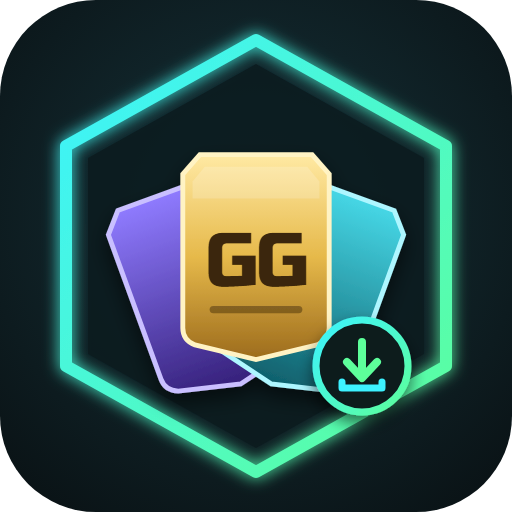

<h1 align="center">Gallery Grab</h1>

<b>Türkçe</b> · <a href="README.en.md">English</a>

  
  
  
  

FC 27 Ultimate Team Web App'e <b>FUT Galeri</b> ekranı ekler: setlerin durumu, fut.gg'nin en ucuz çözümleri ve eksik kartları tek tıkla alma.

> [!WARNING]
> Web App'te otomatik alım yapmak EA kullanım şartlarına aykırıdır; hesabın kısıtlanabilir ya da kalıcı olarak yasaklanabilir. Proje ücretsizdir, satılmaz, EA ile bağlantısı yoktur ve garanti verilmez. Ayrıntılar: [Sorumluluk reddi](#sorumluluk-reddi-ve-yasal-notlar).

## Özellikler

<table>
<tr>
<td width="33%"><b>🖼️ Galeri ekranı</b> 126 set, lig sekmeleri, set puanı ve D–S notları</td>
<td width="33%"><b>💡 İki çözücü</b> fut.gg'nin çözümü ya da sendeki kartları bedava sayan Gallery Grab çözümü</td>
<td width="33%"><b>🛡️ Güvenli alım</b> Kart başı fiyat sınırı, bütçe, coin ve transfer listesi kontrolü</td>
</tr>
<tr>
<td><b>🎯 Token planlayıcı</b> Hedef token ya da bütçeye göre en ucuz plan</td>
<td><b>🔄 Günlük katalog</b> Her gün 21:00'de (TR) GitHub'dan güncellenir</td>
<td><b>🌐 Türkçe / English</b> Bayraklı dil seçici</td>
</tr>
<tr>
<td><b>📋 Genel sekmesi</b> En ucuz sonraki token, tamamlanmaya en yakın setler, bütçeyle en çok token</td>
<td><b>🧺 Çoklu seçim</b> Setleri seç, <b>Sırayla al</b> her seti eşitleyip ulaşılabilir en yüksek notla alır</td>
<td><b>🧾 Son alımlar</b> Galeriden alınan son 200 kart: set, ödenen ve fut.gg fiyatı</td>
</tr>
</table>

## Nasıl çalışır

1. **Tümünü eşitle**: setlerin toplanma durumunu EA'dan okur.
2. **Genel** sekmesindeki önerilerden birini ya da bir seti aç, not sekmesini (D·C·B·A·S) seç.
3. **Eşitle + güncel fiyat**, ardından **Bu çözümü al**. Eksik kartlar pazardaki güncel en ucuz ilandan alınır.
4. Token'ı almak için seti **oyunda** (konsol / PC) Galeri'den notlandır. Web App notlandıramaz.

## Kurulum

İki sürüm var ve ikisi aynı kodu kullanır. **İkisini birlikte kurma.**

**Chrome eklentisi (önerilen)**

1. `chrome://extensions` sayfasını aç, **Geliştirici modu**'nu etkinleştir.
2. **Paketlenmemiş öğe yükle** ile bu klasörü seç.
3. EA FC Web App'i aç ve giriş yap. Oyun açılınca sol menünün en altında **GALLERY** sekmesi görünür.

**Güncelleme:** Chrome paketlenmemiş eklentiyi kendisi güncellemez; **Yenile** yalnız klasördeki dosyaları yeniden okur.
Yeni sürüm çıkınca galeri ekranında *Yeni sürüm var* yazar. Eklenti klasöründeki **`guncelle.bat`**'ı çalıştır
(son sürümü indirip aynı klasörün üstüne yazar), sonra `chrome://extensions`'ta **Yenile**'ye bas.
Elle yapmak istersen: [Releases](https://github.com/JosephWRLD/gallery-grab/releases)'tan son `v1.x` zip'ini indir ve
**aynı klasörün üstüne** aç. Eklentiyi kaldırıp başka klasörden yükleme — kayıtlı veriler silinir.

**Tampermonkey**

1. Chrome'a [Tampermonkey](https://www.tampermonkey.net/) kur.
2. **[Scripti kur](https://raw.githubusercontent.com/JosephWRLD/gallery-grab/main/userscript/gallery-grab.user.js)** bağlantısına tıkla.
3. Web App'i aç; sol menüdeki **GALLERY** sekmesinden paneli aç. Güncellemeleri Tampermonkey kendisi kontrol eder.

## İletişim

Sorun, hata ya da öneri için: **Discord `yusuflnx`** (Galeri ekranının sağ üstünde; tıklayınca kopyalanır).

## Ayrıntılar

<b>Galeri ekranı: tüm özellikler</b>

- **Setler lig sekmeleriyle:** Premier League / Barclays WSL, LALIGA / Liga F, Bundesliga, Ligue 1, Serie A, Ligler, Nadirlikler (126 set). Her kartta `toplanan / gereken`, set puanı, ulaşılan not (D·C·B·A·S) ve alt alta: sonraki token, kazanılan, şu an alınabilen token ve puan, en fazla token.
- **Üst şerit:** galeri seviyesi (oyundan elle girilir, çünkü Web App bu bilgiyi vermiyor), toplam galeri puanı, kazanılabilen puan, kazanılan / şu an alınabilen / en fazla token, tamamlanan set, **oyunda notlandırılacak** setler.
- **Genel sekmesi** (galeri bununla açılır): tüm galeriden öneri listeleri. Her satırda kazanılacak token, alınacak kart sayısı, maliyet ve %5 vergi görünür; **+** ile set o not hedefli çoklu seçime eklenir.
  - **En ucuz sonraki token:** her setin token başına en ucuz sonraki notu.
  - **Tamamlanmaya en yakın:** boş yuva sayısı, doldurma maliyeti ve eksik kartların yüzleri.
  - **S şu an mümkün:** en yüksek notu pazarda ulaşılabilen setler.
  - **Bütçemle en çok token:** coin'inle (ya da kalan galeri bütçesiyle) en çok token veren seçim, tek düğmeyle çoklu seçime eklenir.
- **Tümünü eşitle:** tüm setlerin toplanma durumunu EA'dan okur (Web App'in "konsept oyuncu" araması her kart için `isCollected` ve `gradingScore` döndürüyor). Önce kaç set eşitleneceğini ve tahmini süreyi sorar; son 6 saatte eşitlenenleri atlayabilir. Tek bir set hata verirse bir kez daha dener, olmazsa atlayıp devam eder. Yanındaki **Sadece {lig}** düğmesi yalnız açık sekmedeki setleri eşitler.
- **Set detayı (iki çözüm):** her not için **fut.gg** ya da **Gallery Grab** çözümü seçilir. Gallery Grab çözücüsü sendeki kartları bedava sayar, bonus etiketlerini hesaba katar ve notun eşiğine ulaşan en ucuz dizilimi bulur; hangisi ucuzsa işaretlenir. Sende olan kartlar ✓ ile işaretlenir ve maliyetten düşülür. **Eşitle + güncel fiyat** eksik kartların pazardaki güncel fiyatına bakar; **Bu çözümü al** onaydan sonra eksikleri alır; alım anında çözüm değişmişse almaz, detayı yenilemeni ister.
- **Çoklu seçim ve Sırayla al:** seçilen setler kuyrukta tek tek alınır. Her setten önce set EA'dan yeniden eşitlenir ve not, eksik kartların canlı fiyatına göre ulaşılabilir en yüksek not olarak seçilir. **Durdur** her an çalışır; atlanan kartlara sonunda bir kez daha dönülür.
- **Alım güvenliği:**
  - Her kart için **fiyat sınırı** var: canlı fiyat bakıldıysa canlı fiyatın %25 fazlası, bakılmadıysa fut.gg fiyatının 1,4 katı ya da fut.gg + 2.000 (hangisi büyükse). İstersen üstüne "Kart başına en fazla" sınırı koyabilirsin (varsayılan yok).
  - Sınırı aşan kart alınmaz; raporda gerçek fiyatıyla yazılır ve bir sonraki denemede o fiyat esas alınır.
  - Ayrıca **Galeri bütçesi** (galeri harcaması bu tutara ulaşınca durur) ve coin bakiyesi kontrolü var.
  - Transfer listesi dolunca (100) alım durur.
  - Özel kartlar pazarda kartın kendi nadirliğiyle aranır; oyuncunun başka sürümü yanlışlıkla alınmaz.
  - Holografik ve Başlangıç setlerinde sahiplik Web App'ten doğrulanamadığı için eşitleme ve alım kapalıdır; bu setler yalnız bilgi olarak gösterilir.
- **Alımdan sonra:** kart varsayılan olarak **satışa konur**. Satış fiyatı ödenen ya da fut.gg fiyatı olabilir, ±%20 ayarlanabilir ve ilan süresi seçilebilir. Kart yine toplanmış sayılır; gerçek maliyet ≈ %5 vergidir. İstenirse kart transfer listesinde ya da unassigned'da bırakılır.
- **Oyunda notlandırma:** Web App setleri notlandıramaz. Kart aldığın setler ve çözüm kartlarının hepsi sende olan setler "oyunda notlandır" rozetiyle işaretlenir. Notlandırınca detaydaki **✓ Notlandırdım** düğmesiyle işareti kaldırırsın.
- **Token planlayıcı:** hedef token (Hall of FUT: 300 / 400 / 500 David Luiz / 750 Pato–Hulk) ya da coin bütçesi girersin. Her setten en fazla bir not seçen en ucuz plan hesaplanır; **Planı al** setleri sırayla alır.
- **Son alımlar:** galeriden alınan son 200 kart; zaman, set, ödenen fiyat ve fut.gg fiyatıyla.
- **Hesaba özel veri:** EA hesabı değişince seçilen notlar, notlandırılacaklar, harcama ve son alımlar o hesaba göre ayrı tutulur.
- **Teşhis:** setler eşitlendiği hâlde 0/N görünüyorsa EA'nın ne döndürdüğünü raporlar (alım yapmaz, kişisel bilgi içermez); **Kopyala** ile Discord'dan gönderebilirsin.
- **Sıralama / filtre, Coin ↻, pazar rozeti:** pazarda zaten toplanmış kartlara "✓ Galeride" rozeti gelir.
- **Katalog:** `data/gallery-sets.json`, `tools/build-gallery-sets.mjs` ile fut.gg'den üretilir. GitHub Actions bunu **her gün 21:00'de (TR)** yeniler. Eklenti 21:40'tan sonra ilk açılışta yeni sürümü çeker; indirme başarısız olursa 1 saat sonra yeniden dener, ağ yoksa gömülü kopyayı kullanır. Setin fiyatları 2 günden eskiyse detayda uyarı çıkar.

**Puan:** eklentinin kendi puan motoru taban puanı ve oyunun 21 bonus etiketini (aynı/farklı kulüp-ülke-lig, bronz/gümüş/altın, TOTW, holografik, mevki etiketleri vb.; en yüksek 10'u sayılır) hesaplar. Kurallar katalogla fut.gg'den gelir; detayda "taban + bonus" dökümü görünür. **Bilinen sınır:** **İlk Sahip** bonusu (paketten çıkan kartlar, +%150–500) EA verisinde yok; bu kartları olan setlerde oyundaki puan daha yüksek olabilir.

<b>Oyuncu listesi ekranı (eski özellik)</b>

Listeye eklenen her oyuncudan, hangi versiyon olursa olsun **en ucuz BIN ilanından 1 kart** alır:

- `players.json` üzerinden oyuncu arama ve toplu ekleme
- Yüz / arma / bayrak ile ayırt etme ve "farklı kulüp" uyarısı
- Fiyat ve kulüp taraması
- Bütçe
- Hata protokolü: captcha, 429, 471, 494, softban ya da oturum hatasında durur

Galeri ekranının sağ üstündeki "Oyuncu listesi" bağlantısıyla açılır. Bu ekran yalnız Türkçe.

<b>Geliştirme</b>

- `node --test tests/*.test.mjs`: hesap fonksiyonları, dil sözlüğü ve userscript'in güncelliği testleri.
- `node tools/build-userscript.mjs`: `lib/i18n.js` + `lib/gallery.js` değişince userscript'teki gömülü bloğu yeniler. CI bunu denetler.
- `node tools/build-gallery-sets.mjs`: kataloğu fut.gg'den üretir. Bilinmeyen kategori ya da yeni set için log'a uyarı basar; çözümlerin çoğu okunamazsa dosyayı yazmaz.

<b>Dosya yapısı</b>

| Dosya | Görev |
|---|---|
| `manifest.json` | MV3 tanımı (Chrome eklentisi) |
| `inject.js` | Sayfa bağlamı: UT isteklerinden oturumu yakalar, pazar rozetini ekler |
| `content.js` / `content.css` | Oturumu depoya yazar (adres doğrulamalı), keepalive, sol menü sekmesi ve gömülü panel |
| `background.js` | Görevler: eşitleme, canlı fiyat, alım (fiyat sınırı, bütçe, transfer listesi), satışa koyma, oyuncu listesi |
| `gallery.html` / `gallery.js` | Galeri ekranı |
| `popup.html` / `popup.js` | Oyuncu listesi ekranı |
| `lib/gallery.js` | Saf hesaplar: puan/not, fut.gg planı, fiyat sınırı, token planlayıcı, sıralama |
| `lib/i18n.js` | Türkçe / English sözlük |
| `lib/gallery-api.js` | Web App'in konsept aramasıyla setin kartlarını okuma |
| `lib/ea-api.js` | UT API istemcisi (sekme seçimi, oturum yenileme) |
| `lib/catalog.js` | Katalog yükleme ve günlük GitHub güncellemesi |
| `lib/players.js`, `lib/img.js`, `lib/pricing.js` | Oyuncu arama + isim sözlükleri, görsel adresleri, fiyat basamakları |
| `data/gallery-sets.json` | Set kataloğu (126 set, fut.gg çözümleri ve fiyat tarihleriyle) |
| `userscript/gallery-grab.user.js` | Tampermonkey sürümü |
| `branding/` | Logo ve GitHub sosyal önizleme görseli (HTML kaynaklarıyla) |
| `tools/`, `tests/`, `.github/workflows/` | Katalog/userscript üretimi, testler, günlük katalog işi ve CI |

Kod analizi ve bilinen sınırlar: [ANALIZ.md](ANALIZ.md)

## Sorumluluk reddi ve yasal notlar

Kullanmadan önce oku

- Bu proje **ücretsizdir, satılmaz** ve hiçbir şekilde ticari olarak sunulmaz. Kodu alıp **satmak, ücretli hizmete/aboneliğe katmak ya da başka türlü ticari amaçla kullanmak lisansla yasaklanmıştır**; kişisel kullanım, değiştirme ve paylaşma serbesttir. Kaynak kodu açıktır, lisansı [PolyForm Noncommercial 1.0.0](LICENSE)'dır: **ticari kullanım ve satış yasaktır** ve **hiçbir garanti verilmez** ("as is").
- Bu projenin **Electronic Arts Inc. ile hiçbir bağlantısı yoktur**; EA tarafından onaylanmamış, desteklenmemiş ya da sponsor edilmemiştir. "EA", "EA SPORTS", "FC", "FIFA" ve "Ultimate Team" sahiplerinin ticari markalarıdır; burada yalnızca tanımlama amacıyla anılır. Depoda EA'ya ait hiçbir görsel, ses, kod ya da veri bulunmaz. Script çalışırken yalnızca kullanıcının tarayıcısının zaten indirdiği verileri okur.
- **EA Web App'te otomatik işlem yapmak EA kullanım şartlarına aykırıdır.** Kullanmak hesabının kısıtlanmasına, oyun içi varlıklarının silinmesine ya da kalıcı yasaklanmasına yol açabilir. Bu riski kabul etmiyorsan kullanma.
- Yazılım **eğitim ve kişisel deneme amacıyla** paylaşılmıştır. Kullanımdan doğan tüm sonuçlar (hesap yaptırımları, coin kaybı, veri kaybı dâhil) **tamamen kullanıcının sorumluluğundadır**; geliştirici hiçbir sorumluluk kabul etmez.
- Herhangi bir güvenlik önlemi, ödeme sistemi ya da koruma mekanizması atlatılmaz; script kullanıcının kendi oturumunu, kendi tarayıcısında kullanır. Hesap satışı, coin ticareti ya da üçüncü kişiler adına işlem için kullanılamaz.
- Set kataloğu (eşikler, ödüller, önerilen çözümler) herkese açık [fut.gg](https://www.fut.gg/fut-gallery/) sayfalarından günlük olarak derlenir; fut.gg ile de bir bağlantı yoktur.
- Hak sahibi bir kurum kaldırılmasını isterse depo kaldırılır. Bunun için [İletişim](#i̇leti̇şi̇m) bölümündeki adrese yazılması yeterlidir.

